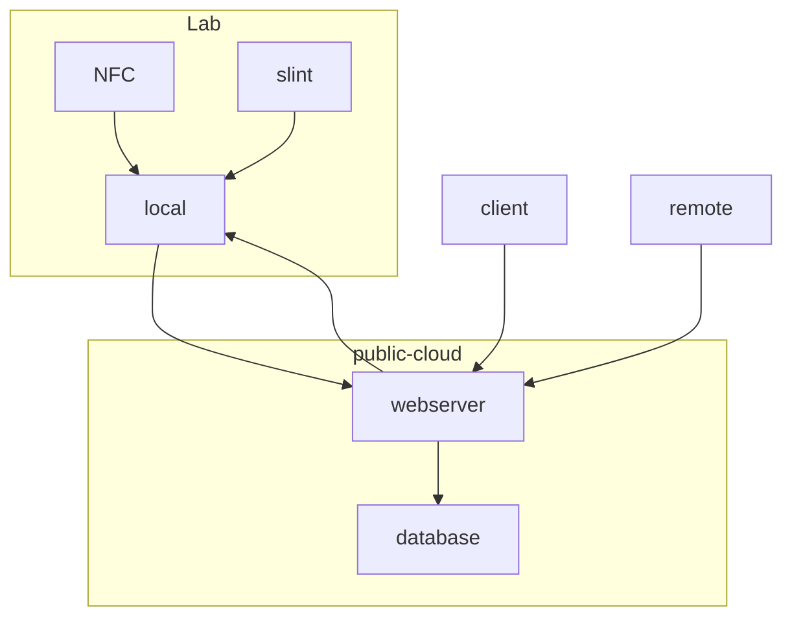

# lab_presence
An app that visualizes laboratory occupancy status.

- local: Maintain status in the laboratory.
- client: Someone checking presence status from outside.
- remote: Someone who changes their presence status from an external location
- NFC: Update your presence status in the laboratory.
- slint: Display presence status in the laboratory.
- webserver: Ensuring redundancy for local and cloud presence status, and serving as a gateway for external communication.

